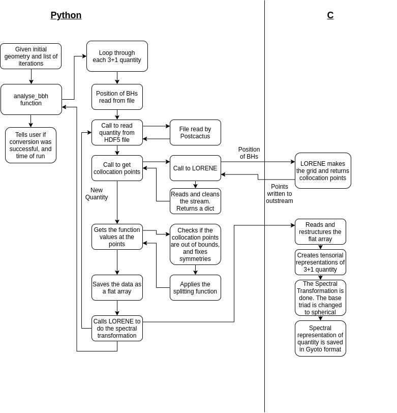

Overview of the Implementation
==============================

Einstein Toolkit, LORENE and the Spectral Transformation
--------------------------------------------------------

One of the most used tool to do raytracing in numerical spacetimes is Gyoto. When using simulated spacetime from Einstein Toolkit in Gyoto we soon get stuck in the fact that they use different formalisms.
Einstein Toolkit used grid function and finite difference, while Gyoto -- and it underlying code LORENE -- uses a spectral method. This code is made to converte data between these two formalism.

One of the most tedious tasks is the actuall spectral transformation. This involves a good deal of compactification of coordinates and fast Fourier transformations to get the spectral transformations. Since Einstein Toolkit gives the grid functions in Cartesian coordinates, while Gyoto uses spherical coordinates, a change of basis triads has to be done at some point.

Thankfully LORENE has most of these capabilities build into it, in a way which is easy to use. LORENE is able to create spectral grids centered at a given position, then give collocation points needed to do the spectral transformation. Given the grid function values at these points, LORENE can, with only one command, transform a quantity into its spectral representation. It also lets the user change between different basis triads. LORENE also have the capability to do tensor algebra, and save these tensors in a way that Gyoto can read them. In other words, LORENE is able to handle all the tasks related to the spectral representation.

Splitting the Grids
-------------------
One of the challanges of using Gyoto (and LORENE) to do the raytracing is the fact that they are written with one spherical symmetric object in mind.
By introducing a second object -- i.e. the second black hole of the binary black hole system -- we are breaking this symmetry.
If we choose to have the center of the spectral grid at one of the black holes when doing the tranformation, we will have a good resolution of said black hole,
but the second black hole and intermediate regions will, in most cases, have a worse resolution, leading to atrifacts in the spacetime.

To combat this problem, the, so called, splitting function is introduced. The actual function can be found in the method
:meth:`ETConverter.ETInterpolater.split_function` 
The way this work is that one spectral grid is constructed and centered at each black hole. In this way we have one grid with one of the black hole resolved and the other not, and vice versa.
We can now apply this splitting function to the grid. This will smoothly set the region around the unresolved object to zero, making the noise disapprear and leaving the resolved parts untouch.
We now have each object well resolved in one of the grids and removed from the other. We can now do the spectral transformation as described below.
The result will be two grids with one resolved objects each. We can then add the two grids together and will be left with one grid with both the objects well resolved.

First Version in Python
-----------------------

As seen above LORENE can take care of everything that has to do with the spectral transformation, but we still need to take care of the reading of the Einstein Toolkit files, the interpolation and the post-processing. Even though I hoped to be able to integrate this functionality straight into an Einstein Toolkit thorn, I instead decided that it would be easier to implement the conversion tool in Python first. This was meant to be a proof of concept, and would later be moved into Einstein Toolkit (there running in C/C++ and/or FORTRAN).

The first hurdle I needed to cross was the reading of the Einstein Toolkit data and its interpolation. Reading of HDF5 files in Python is not that difficult, but since Einstein Toolkit formats the data in its own way -- to deal with time steps and the adaptive mesh grid --, this was not a trivial task. Thankfully I wasn't the first person having to do this, meaning that there existed tools made for Python to handle this kind of data. The library I chose to use was called PostCactus/PyCactusET . This library can both read the Einstein Toolkit data and interpolate it, and was used to read the grid functions. 

The position and apparent horizons of the black holes were also needed for the spectral grid as well as the splitting function. This was handled directly by my own code, instead of going through any library.

With the grid functions, the apparent horizon and the black hole positions handled, the next step was to make the Python script able to communicate with LORENE. This was done by simply calling a LORENE script as a subprocess using Python. When the Python program need the collocation points, the LORENE script was called and the out-stream of this script was caught by Python, where it was processed to reveal the points. The Python program then did all the interpolation of the grid functions on these collocation points, and the application of the splitting function. The results were then written to a file -- with a certain format --, and the LORENE script was again called, with the information that it now had to read the processed data and do the transformation. 

Having the processed data, LORENE could now do its magic. Making a scalar for the lapse function, a vector for the shift and a tensor for the spatial metric and the extrinsic curvature, the LORENE script could read the files and fill the components of these objects. Having these it could quickly do the spectral transformation and save the results as a file readable to Gyoto.

Schematic View of the Code
--------------------------

In-depth of the Python Code
----------------------------------------------

In the figure above one can see a schematic representation of the conversion code. The user only needs to take two steps to run the code: First the user creates a geometry on which the Einstein Toolkit data will be read. This is a two or three dimensional, uniform grid. Einstein Toolkit will in many instances used symmetries in the simulated systems to reduce run time, meaning that in many cases only 1/6th if the simulated space is used -- only positive values of x, y and z. Because of this, the user have the option to make a strictly positive geometry, with the reason being that the code will read the function values whether there exits a value there or not (with not existent values being set to 0). This will lead boundary noise in the areas between the points with simulated function values, and the ones set to 0 by default. By only having a geometry defined at the points were function values exist, we ensure that we don't get this boundary noise. The geometry is made by simply calling

.. code-block:: python

    inter = ETInterpolater(sim_folder, number_sim_bodies)
    g = inter.make_positive_geometry(corner, grid_points)

    
The user will then have to make a list over the iterations they want to look at. Then with a simple function call

.. code-block:: python

   it = [0, 128, 256] #And more
   inter.analyse_bbh(g, quantity="", it, test=True)

the code will start its magic (test is there to make plots during the run, to see that everything works). The code will now start to run procedures described in the second column and all columns to the right in the figure 

1. The code will read the position and radius of the black holes from Einstein Toolkit. The position will be used to calculate the splitting function.
2. For each iteration given by the user, the code will loop though all the 3+1 quantities -- the lapse function, and all the different indices of the shift vector, the spatial metric and the extrinsic curvature. The below is what will happen for each quantity at a given iteration.
3. A function is called to read the Einstein Toolkit data. Depending on the geometry given by the user, either the xy-plane is read in, or the xyz-space. This function will return a interpolated function of the grid function, making it possible to get the function value at an arbitrary point inside the defined geometry. 
4. Now a call is made to get the collocation points needed to do the spectral transformation. A C code is called with the information about the origin of one of the black holes -- so that the grid can be centered correctly. The C code has defined the different domains, and how many points it should use for each domain. Using this, and the origin given by the Python code, LORENE will calculate the spectral grid and print it to outstream. The Python function then captures the stream the C code makes, and reads and formats lists of collocation points. The program now has the x, y and z coordinates of all the collocation points.
5. The code will now begin to calculate the function value on the collocation points. This is done in the following steps

    - The symmetries discussed above must be taken care of. For the most trivial case, with positive x, y and z-values, all negative coordinates are simply mirrored unto the positive side. For other symmetries, other measures are taken.
    - Care are taken at the bounds. The collocation points may be outside of the simulated geometry, so points outside the geometry must be either given a value from inside the geometry or extrapolated.
    - The function values are calculated for the desymmeterized and bounded values. 
    - The splitting function is applied to the function values.

    The end result is then returned as a flat array, with a mapping back to the formatting used by the collocation points. The mapping is ``d[l][k][j][i] =  (\sum_{0 <= m < l} n_r[m]*n_t[m]*n_p[m]) + k*n_t[l]*n_r[l] + j*n_r[l] + i``, with ``l`` being the domain, ``k`` being the k'th ``phi-value``, ``j`` being the j'th ``theta-value`` and ``i`` being the i'th ``r-value``, and ``n_r``, ``n_t`` and ``n_p`` being the arrays of points in the different domains. This array is written to file with a specific name.
6. Points 4 and 5 are done for the second black hole (if there are two black holes).
7. Points 3-6 are done for the next quantity, until all are processed.
8. Having all the collocation points filled with function values for each 3+1 quantity, the C code is again called. This code will then

    - The C code reads the files with the function values. 
    - All the 3+1 quantities are defined as tensorial objects, and their values are read from the read arrays.
    - LORENE is then asked to make a spectral transformation on the quantities.
    - Since Einstein Toolkit is in Cartesian coordinates, the 3+1 quantities are currently in Cartesian coordinates as well. Since Gyoto used spherical coordinates, the base triads of the quantities are changed to spherical coordinates.
    - The quantities are then saved together with the map of the spectral grid to a file readable by Gyoto.

The program is now done, and Gyoto can be run. 

Setup of the C Code
-------------------
The C code needs to be set up before using. This means that the user will need to specify some variables needed to run

.. code-block:: C

    int nz = 6 ; 	// Number of domains
    int nr_array[]  = {55, 55, 55, 85, 17, 11}; // Number of r points for each domain
    int nt_array[]  = {11, 11, 11, 11, 11, 11}; // Number of theta points for each domain
    int np_array[]  = {52, 72, 72, 82, 42, 42}; // Number of phi points for each domain

    ...

    // Type of coordsystem for each domain. Should always be RARE first, UNSURR last and FIN inbetween
    int type_r[] = {RARE, FIN, FIN, FIN, FIN, UNSURR}; 
    int symmetry_theta = SYM ; // symmetry with respect to the equatorial plane
    int symmetry_phi = NONSYM ; // no symmetry in phi
    bool compact = true ; // external domain is compactified

    ...

    // radial boundaries of each domain:
    double r_limits[] = {0., 0.5, 1.5, 4, 8, 20, __infinity} ;

The first set of variables is the number of domains and the number of collocation points with in each domain.

The second set of variables are the type of coordinates in each domain. These should be set as descriped in the code.
The other variables are the symmeteres and compactness of the coordinates. These should be left alone.

The last variables is the radial boundaries of each domain. The first and second domain should cover the inner black hole,
and the second should be in it own domain as well. There should be at least one domain between the out black hole and infinite, so that
the gravitational waves are resolved here.

Results of the Code
-------------------
After running through the conversion program described above, we are left with two files per quantify per iteration readable by Gyoto. 
The reason we have two file is the splitting of the 3+1 quantity discussed above. 
When Gyoto calculates the geodesic of a photon, it will read the two files and use then to calculate the quantity 
``g(x) = g(x)_1 + g(x)_2`` where ``g(x)_1`` comes from the first file and ``g(x)_2`` from the second. 

